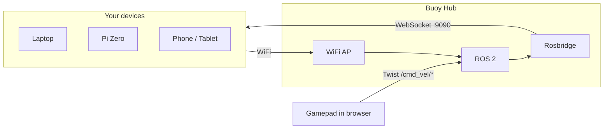
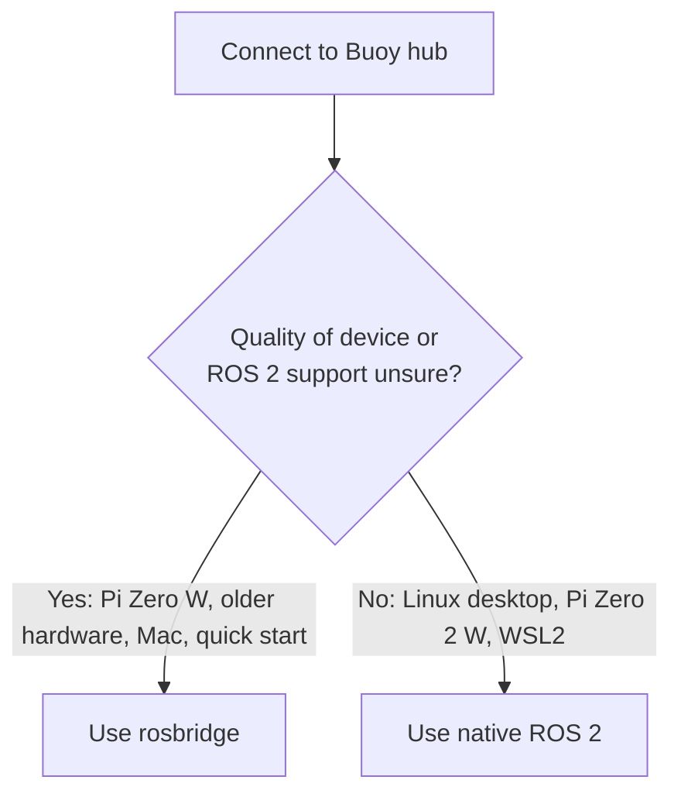

# Connect Your Device

This guide helps **new users** connect their device (Raspberry Pi Zero, Linux laptop, Mac, or Windows PC) to the Buoy ROS hub. You'll subscribe to topics, listen for joystick commands, and publish messages—with your first success in about 5 minutes.

---

## Before you start

Before diving in, make sure:

- **Hub is running** – Someone has set up the Buoy hub (Raspberry Pi or Linux) and it's powered on.
- **You have credentials** – WiFi SSID and passphrase. Default is `Buoy` / `ChangeMe`. The hub operator may have changed these.
- **You're on the network** – You can join the Buoy WiFi (or the same LAN if the hub runs headless).
- **Quick check** – Run `ping buoy.buoy` or open `http://buoy.buoy` in a browser. If DNS doesn't work, use IP `10.3.141.1` instead.

---

## Quick start (5 min)

Get your first program running in about 5 minutes. You can use **Python** or **JavaScript**—choose the option that fits you. You need a connection to the Buoy WiFi.

### Option A: Python

1. **Install roslibpy** (~1 min):
   ```bash
   pip install roslibpy
   ```

2. **Save and run this script** (~2 min). Save as `twist_listener.py`:
   ```python
   #!/usr/bin/env python3
   """Subscribe to Twist from the Buoy hub. Run: python3 twist_listener.py"""
   from roslibpy import Ros, Topic

   ros = Ros('buoy.buoy', 9090)
   ros.run()

   def on_twist(msg):
       linear_x = msg.get('linear', {}).get('x', 0)
       angular_z = msg.get('angular', {}).get('z', 0)
       print(f"Twist: linear.x={linear_x:.2f} angular.z={angular_z:.2f}")

   listener = Topic(ros, '/cmd_vel/gamepad', 'geometry_msgs/msg/Twist')
   listener.subscribe(on_twist)
   print("Listening for Twist on /cmd_vel/gamepad. Move a joystick on the Gamepad page...")
   print("Press Ctrl+C to stop.")

   try:
       import time
       while True:
           time.sleep(0.1)
   except KeyboardInterrupt:
       pass
   finally:
       ros.terminate()
   ```
   Run: `python3 twist_listener.py`

3. **Generate data** (~1 min): Open `http://buoy.buoy` → **Gamepad & Joysticks**, register a controller (e.g. name `gamepad`), and move the stick.

4. **See output** – Your terminal should print Twist messages. Success!

### Option B: JavaScript (browser)

1. **No install needed** – Open [Live Coding](http://buoy.buoy/sandbox/live-coding.html) in your browser (you must be on Buoy WiFi).

2. **Paste and run** – Replace the default code with the JavaScript example from the [Subscribe to Twist](#subscribe-to-twist-joystick-commands) section below, then press **Ctrl+Enter** to run.

3. **Generate data** – Open another tab: `http://buoy.buoy` → **Gamepad & Joysticks**, register a controller, and move the stick.

4. **See output** – Check the Live Coding console for Twist messages.

If Python or pip fails (Option A), see the device-specific setup for your platform below.

---

## How it works



**Key concepts:**

- **Rosbridge** – Lets you talk to ROS from Python or JavaScript without installing ROS. Connects via WebSocket to `ws://buoy.buoy:9090`. Works on almost any device.
- **Native ROS 2** – Full ROS 2 (rclpy) on your device. Connects directly via DDS. Requires ROS 2 Jazzy install.
- **Where joystick data comes from** – Someone opens the web portal → **Gamepad & Joysticks**, registers a controller, and it publishes Twist messages to `/cmd_vel/<name>`. Your script subscribes to that topic.

---

## Choose your path

Pick the approach that fits your device and goals:

| Path | Best for | Requires ROS 2 install? | Works on |
|------|----------|--------------------------|----------|
| **Rosbridge** | Most users; low-resource devices; quick setup | No | Pi Zero (all), Linux, Mac, Windows |
| **Native ROS 2** | Full DDS, lower latency, advanced ROS features | Yes | Linux, Pi Zero 2 W, Windows (WSL2) |

**Recommendation:** Default to **rosbridge** unless you specifically need native ROS 2 (DDS, rclpy services/actions, etc.).



---

## Learning path

Follow these stages to build skills step by step:

| Stage | What to do | Time | Outcome |
|-------|------------|------|---------|
| **1. Connect** | Join Buoy WiFi, verify `http://buoy.buoy` loads | ~1 min | On the network |
| **2. Subscribe** | Run the rosbridge subscribe script, see Twist data | ~2 min | First program works |
| **3. Do something** | Open [Turtle Draw](http://buoy.buoy/sandbox/turtle-draw.html), control it with Gamepad; or use [Listen & Publish](http://buoy.buoy/ros-try.html) | ~5 min | See data drive something |
| **4. Publish** | Run a publish script, or use Listen & Publish to send messages | ~3 min | Send data to ROS |
| **5. Go further** | Try native ROS 2, [Foxglove Studio](https://studio.foxglove.dev), or build your own node | Variable | Deeper exploration |

---

## Raspberry Pi Zero

### Connectivity

| Model | WiFi | Notes |
|-------|------|-------|
| Pi Zero W, Zero 2 W | Built-in | Join Buoy WiFi directly |
| Original Pi Zero | None | USB Ethernet or USB WiFi dongle required |

### Path availability

- **Rosbridge:** Yes (recommended). Works on all Pi Zero models.
- **Native ROS 2:** Pi Zero 2 W only (arm64). Original Pi Zero (armv6) and Pi Zero W are not officially supported for ROS 2.

### Prerequisites

- Raspberry Pi OS (Bullseye or Bookworm)
- Python 3.7+
- Connected to Buoy WiFi

### Rosbridge setup (~5 min)

1. Install:
   ```bash
   pip install roslibpy
   ```
   Or: `pip3 install roslibpy` or `python3 -m pip install roslibpy`

2. Verify: Run the Quick start script above. If `buoy.buoy` doesn't resolve, use `10.3.141.1` instead.

### Base code: Subscribe to joystick (rosbridge)

```python
#!/usr/bin/env python3
"""Pi Zero: Subscribe to Twist from Buoy. Run: python3 twist_listener.py"""
from roslibpy import Ros, Topic

HOST = 'buoy.buoy'  # or '10.3.141.1' if buoy.buoy doesn't resolve
ros = Ros(HOST, 9090)
ros.run()

def on_twist(msg):
    linear_x = msg.get('linear', {}).get('x', 0)
    angular_z = msg.get('angular', {}).get('z', 0)
    print(f"linear.x={linear_x:.2f} angular.z={angular_z:.2f}")

listener = Topic(ros, '/cmd_vel/gamepad', 'geometry_msgs/msg/Twist')
listener.subscribe(on_twist)
print("Listening on /cmd_vel/gamepad. Press Ctrl+C to stop.")

try:
    import time
    while True:
        time.sleep(0.1)
except KeyboardInterrupt:
    pass
finally:
    ros.terminate()
```

---

## Linux

### Connectivity

- WiFi or Ethernet. Connect to Buoy WiFi, or same LAN as a headless hub.

### Path availability

- **Rosbridge:** Yes (~5 min setup).
- **Native ROS 2:** Yes. Install ROS 2 Jazzy.

### Prerequisites

- Python 3.7+ (for rosbridge)
- For native: Ubuntu 24.04 or compatible distro for ROS 2 Jazzy

### Rosbridge setup (~5 min)

```bash
pip install roslibpy
```

Use the Quick start script or the Pi Zero script above (replace `buoy.buoy` with `10.3.141.1` if needed).

### Native ROS 2 setup

1. Install ROS 2 Jazzy: [docs.ros.org/en/jazzy/Installation](https://docs.ros.org/en/jazzy/Installation.html)
2. Source and set domain:
   ```bash
   source /opt/ros/jazzy/setup.bash
   export ROS_DOMAIN_ID=0
   ```
3. Run your rclpy nodes. See Code templates below.

### Base code: Subscribe (rosbridge)

Same as Pi Zero script above. Works on any Linux with Python.

### Base code: Subscribe (native ROS 2)

```python
#!/usr/bin/env python3
"""Linux native: Subscribe to Twist. Run: ROS_DOMAIN_ID=0 python3 twist_listener_native.py"""
import rclpy
from rclpy.node import Node
from geometry_msgs.msg import Twist

class TwistListener(Node):
    def __init__(self):
        super().__init__('twist_listener')
        self.sub = self.create_subscription(Twist, '/cmd_vel/gamepad', self.callback, 10)
    def callback(self, msg):
        self.get_logger().info(f"linear.x={msg.linear.x:.2f} angular.z={msg.angular.z:.2f}")

def main():
    rclpy.init()
    rclpy.spin(TwistListener())
    rclpy.shutdown()

if __name__ == '__main__':
    main()
```

---

## macOS

### Connectivity

- Built-in WiFi. Join Buoy WiFi.

### Path availability

- **Rosbridge:** Yes (~5 min setup). Recommended.
- **Native ROS 2:** No official binary. Use Docker or build from source (advanced).

### Prerequisites

- Python 3.7+ (install via python.org or Homebrew)

### Rosbridge setup (~5 min)

```bash
pip install roslibpy
```

Use the Quick start or Pi Zero script. If `buoy.buoy` fails, use `10.3.141.1`.

### Base code: Subscribe to joystick (rosbridge)

Same as Pi Zero script above.

---

## Windows

### Connectivity

- Built-in WiFi or Ethernet. Join Buoy WiFi or same LAN.

### Path availability

- **Rosbridge:** Yes (~5 min setup). Recommended.
- **Native ROS 2:** Via WSL2 + Ubuntu. See Linux section for setup inside WSL.

### Prerequisites

- Python 3.7+ (python.org or Microsoft Store)
- For native: WSL2 with Ubuntu 24.04

### Rosbridge setup (~5 min)

```bash
pip install roslibpy
```

Use the Quick start or Pi Zero script. If `buoy.buoy` doesn't resolve, use `10.3.141.1`.

### Base code: Subscribe to joystick (rosbridge)

Same as Pi Zero script above.

---

## Code templates (central reference)

Use these templates as a starting point. Prefer **rosbridge** if your device doesn't have ROS 2 or you want a simple setup. Choose **Python** or **JavaScript** for rosbridge examples.

### Subscribe to Twist (joystick commands)

**Rosbridge** – choose your language:

:::code-tabs
**Python**
```python
from roslibpy import Ros, Topic

ros = Ros('buoy.buoy', 9090)
ros.run()

def on_twist(msg):
    print(msg)

listener = Topic(ros, '/cmd_vel/gamepad', 'geometry_msgs/msg/Twist')
listener.subscribe(on_twist)

import time
try:
    while True:
        time.sleep(0.1)
finally:
    ros.terminate()
```
**JavaScript**
```javascript
// Browser: use Live Coding or include roslib. Node: npm install roslib
const ros = new ROSLIB.Ros({ url: 'ws://buoy.buoy:9090' });
ros.on('connection', () => {
  const listener = new ROSLIB.Topic({
    ros, name: '/cmd_vel/gamepad', messageType: 'geometry_msgs/msg/Twist'
  });
  listener.subscribe((msg) => {
    const lx = msg.linear?.x ?? 0;
    const az = msg.angular?.z ?? 0;
    console.log(`linear.x=${lx.toFixed(2)} angular.z=${az.toFixed(2)}`);
  });
});
```
:::

**Native ROS 2 (Python):**

```python
# Run: ROS_DOMAIN_ID=0 python3 script.py
import rclpy
from rclpy.node import Node
from geometry_msgs.msg import Twist

class TwistListener(Node):
    def __init__(self):
        super().__init__('twist_listener')
        self.sub = self.create_subscription(Twist, '/cmd_vel/gamepad', self.callback, 10)
    def callback(self, msg):
        self.get_logger().info(f"linear.x={msg.linear.x} angular.z={msg.angular.z}")

rclpy.init()
rclpy.spin(TwistListener())
rclpy.shutdown()
```

### Publish Twist

**Rosbridge** – choose your language:

:::code-tabs
**Python**
```python
from roslibpy import Ros, Topic

ros = Ros('buoy.buoy', 9090)
ros.run()

pub = Topic(ros, '/cmd_vel/my_robot', 'geometry_msgs/msg/Twist')
pub.advertise()
pub.publish({'linear': {'x': 0.5, 'y': 0, 'z': 0}, 'angular': {'x': 0, 'y': 0, 'z': 0}})

import time
time.sleep(0.5)
ros.terminate()
```
**JavaScript**
```javascript
const ros = new ROSLIB.Ros({ url: 'ws://buoy.buoy:9090' });
ros.on('connection', () => {
  const pub = new ROSLIB.Topic({
    ros, name: '/cmd_vel/my_robot', messageType: 'geometry_msgs/msg/Twist'
  });
  pub.advertise();
  pub.publish({ linear: { x: 0.5, y: 0, z: 0 }, angular: { x: 0, y: 0, z: 0 } });
  setTimeout(() => ros.close(), 500);
});
```
:::

**Native ROS 2 (Python):**

```python
# Run: ROS_DOMAIN_ID=0 python3 script.py
import rclpy
from rclpy.node import Node
from geometry_msgs.msg import Twist

class TwistPublisher(Node):
    def __init__(self):
        super().__init__('twist_publisher')
        self.pub = self.create_publisher(Twist, '/cmd_vel/my_robot', 10)
        self.timer = self.create_timer(0.1, self.tick)
    def tick(self):
        msg = Twist()
        msg.linear.x = 0.5
        self.pub.publish(msg)

rclpy.init()
rclpy.spin(TwistPublisher())
rclpy.shutdown()
```

### Subscribe to string (chatter)

**Rosbridge** – choose your language:

:::code-tabs
**Python**
```python
from roslibpy import Ros, Topic

ros = Ros('buoy.buoy', 9090)
ros.run()

def on_string(msg):
    print("Heard:", msg.get('data', ''))

listener = Topic(ros, '/chatter', 'std_msgs/msg/String')
listener.subscribe(on_string)

import time
try:
    while True:
        time.sleep(0.1)
finally:
    ros.terminate()
```
**JavaScript**
```javascript
const ros = new ROSLIB.Ros({ url: 'ws://buoy.buoy:9090' });
ros.on('connection', () => {
  const listener = new ROSLIB.Topic({
    ros, name: '/chatter', messageType: 'std_msgs/msg/String'
  });
  listener.subscribe((msg) => console.log('Heard:', msg.data));
});
```
:::

**Native ROS 2 (Python):**

```python
# Run: ROS_DOMAIN_ID=0 python3 script.py
import rclpy
from rclpy.node import Node
from std_msgs.msg import String

class StringListener(Node):
    def __init__(self):
        super().__init__('string_listener')
        self.sub = self.create_subscription(String, 'chatter', self.callback, 10)
    def callback(self, msg):
        self.get_logger().info(f'Heard: "{msg.data}"')

rclpy.init()
rclpy.spin(StringListener())
rclpy.shutdown()
```

---

## Troubleshooting

| Problem | Likely cause | Fix |
|---------|--------------|-----|
| `buoy.buoy` doesn't resolve | DNS not working | Use `10.3.141.1` as hostname in your script |
| Connection refused (rosbridge) | Hub unreachable or port closed | Verify `http://buoy.buoy` loads in browser; confirm rosbridge is running on port 9090; check firewall |
| No Twist messages | No publisher | Open [Gamepad & Joysticks](http://buoy.buoy/gamepad.html), register a controller, move the stick |
| Native: no discovery | Wrong domain or multicast blocked | Set `ROS_DOMAIN_ID=0`; check firewall allows DDS multicast (UDP) |
| `pip install roslibpy` fails | Python/pip setup | Try `pip3 install roslibpy` or `python3 -m pip install roslibpy`; use a virtual environment if needed; or use the [JavaScript (browser)](#option-b-javascript-browser) option instead |

---

## Next steps

- **Turtle Draw** – [http://buoy.buoy/sandbox/turtle-draw.html](http://buoy.buoy/sandbox/turtle-draw.html) – Control a turtle with Twist; select a controller topic
- **Listen & Publish** – [http://buoy.buoy/ros-try.html](http://buoy.buoy/ros-try.html) – Subscribe and publish from the browser
- **Foxglove Studio** – [studio.foxglove.dev](https://studio.foxglove.dev) – Connect to `ws://buoy.buoy:9090` for visualization
- **Deeper concepts** – [User guide: connecting and interacting with ROS devices](ros-hub.md) – ROS domains, more examples

---

## Quick reference

| Setting | Value |
|---------|-------|
| Hub hostname | `buoy.buoy` (or `10.3.141.1`) |
| Rosbridge URL | `ws://buoy.buoy:9090` |
| ROS domain | `ROS_DOMAIN_ID=0` |
| Joystick topic | `/cmd_vel/gamepad` (or `/cmd_vel/<name>`) |
| Chatter topic | `/chatter` |
| Twist type | `geometry_msgs/msg/Twist` |
