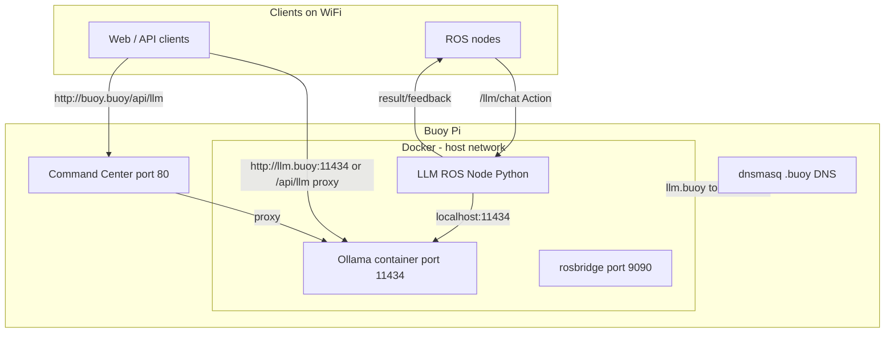

# Buoy LLM – Ollama, Whisper, and ROS integration

This guide covers the **LLM variant** of Buoy, which adds Ollama, Whisper (speech-to-text), and a ROS 2 Action server for multimodal LLM requests. The LLM variant requires an 8GB+ Raspberry Pi 5 and is built with `uv run build --with-llm`. Two models are used automatically: **Qwen2.5:1.5b** for text/audio (reasoning) and **Moondream** for vision (image understanding).

---

## Architecture



---

## API Reference for Clients

### Summary

| Interface | Model selection | Client action |
|-----------|-----------------|---------------|
| **ROS 2 Action** `/llm/chat` | Automatic | Set `modality` (`text`, `image`, or `audio`). Node routes to the correct model. |
| **HTTP API** `/api/llm/api/chat` | Client-specified | Include `model` in request body. Use `qwen2.5:1.5b` for text/audio, `moondream` for vision. |

### ROS 2 Action – no model parameter

ROS clients **do not** specify a model. The node selects it from `modality`:

- `modality: "text"` or `"audio"` → Qwen2.5:1.5b (reasoning)
- `modality: "image"` → Moondream (vision)

Goal fields: `prompt`, `modality`, `payload_base64`, `timeout_sec`, `requester_id`.

### HTTP API – model required in request body

HTTP clients **must** include `model` in the JSON body. Use the model that matches your request type:

| Request type | Model | Example |
|--------------|-------|---------|
| Text chat | `qwen2.5:1.5b` | `{"model": "qwen2.5:1.5b", "messages": [{"role": "user", "content": "Hello"}]}` |
| Vision (with image) | `moondream` | `{"model": "moondream", "messages": [...], "images": ["<base64>"]}` |

Using the wrong model (e.g. `moondream` for text-only) may work but gives suboptimal results. Using `qwen2.5:1.5b` for image requests will fail (Qwen is text-only).

---

## HTTP API

**Direct access:** `http://llm.buoy:11434` (or `http://10.3.141.1:11434`)

**Via command center proxy:** `http://buoy.buoy/api/llm/...` – forwards to Ollama. If Ollama is unreachable, returns 503 with `{"error": "LLM service not available"}`.

Ollama exposes an OpenAI-compatible API. **Choose the model based on modality:**
- **Text/audio:** `{"model": "qwen2.5:1.5b", "messages": [...]}`
- **Vision (images):** `{"model": "moondream", "messages": [...], "images": ["<base64>"]}`
- Generate: `POST /api/generate`

**Example (text):**
```bash
curl -X POST http://buoy.buoy/api/llm/api/chat \
  -H "Content-Type: application/json" \
  -d '{"model": "qwen2.5:1.5b", "messages": [{"role": "user", "content": "What is 2+2?"}], "stream": false}'
```

**Example (vision):**
```bash
curl -X POST http://buoy.buoy/api/llm/api/chat \
  -H "Content-Type: application/json" \
  -d '{"model": "moondream", "messages": [{"role": "user", "content": "Describe this image"}], "images": ["<base64-encoded-image>"], "stream": false}'
```

---

## ROS 2 Action

The LLM node exposes a **ROS 2 Action** at `/llm/chat` (type `llm_msgs/action/Chat`). Actions support long-running inference with optional feedback and cancellation.

| Action   | Type              | Description                    |
|----------|-------------------|--------------------------------|
| `/llm/chat` | llm_msgs/action/Chat | Multimodal LLM request (text, image, audio) |

### Goal (request)

| Field          | Type   | Description                                      |
|----------------|--------|--------------------------------------------------|
| `prompt`       | string | Text prompt for the LLM                          |
| `modality`     | string | `text`, `image`, or `audio`                      |
| `payload_base64` | string | Base64-encoded image or audio (omit for text)   |
| `timeout_sec`  | float32 | Max seconds for inference (0 = use default 30) |
| `requester_id` | string | Client identifier (for fairness)                 |

### Result

| Field          | Type   | Description                          |
|----------------|--------|--------------------------------------|
| `content`      | string | LLM response text                    |
| `error_message`| string | Error details if `success` is false  |
| `success`      | bool   | True if inference succeeded          |

### Feedback (optional, during execution)

| Field      | Type   | Description                    |
|------------|--------|--------------------------------|
| `status`   | string | e.g. `"transcribing"`, `"generating"` |
| `progress` | float32| 0.0–1.0                        |

### Fairness

Each `requester_id` may have at most one active goal. New goals from the same requester are rejected with `error_message: "Already have an active request from this requester"`.

### Parameters (configurable)

| Parameter            | Default                    | Description        |
|----------------------|----------------------------|--------------------|
| `ollama_host`        | `http://127.0.0.1:11434`    | Ollama API URL     |
| `whisper_url`        | `http://127.0.0.1:9000/asr` | Whisper ASR URL    |
| `model`              | `qwen2.5:1.5b`             | Text/audio model (reasoning)        |
| `vision_model`       | `moondream`                | Image model (vision)                 |
| `default_timeout_sec`| `30`                        | Default timeout    |

The node selects the model automatically: `vision_model` for `modality: "image"`, `model` for text and audio. Override via env vars (`OLLAMA_HOST`, `WHISPER_URL`, `LLM_MODEL`, `LLM_VISION_MODEL`, `LLM_TIMEOUT_SEC`) or `ros2 param set`.

---

## Modalities

- **Text:** Send `modality: "text"`, omit `payload_base64`. Uses Qwen2.5:1.5b for reasoning.
- **Image:** Send `modality: "image"`, `payload_base64` with base64-encoded image. Uses Moondream for vision.
- **Audio:** Send `modality: "audio"`, `payload_base64` with base64-encoded audio. Whisper transcribes first, then the text is sent to Qwen.

---

## Python example (Action client)

```python
import rclpy
from rclpy.action import ActionClient
from rclpy.node import Node

from llm_msgs.action import Chat


class LLMClient(Node):
    def __init__(self):
        super().__init__("llm_client")
        self._client = ActionClient(self, Chat, "/llm/chat")

    def send_goal(self, prompt: str, modality: str = "text", payload_b64: str = ""):
        goal = Chat.Goal()
        goal.prompt = prompt
        goal.modality = modality
        goal.payload_base64 = payload_b64
        goal.timeout_sec = 30.0
        goal.requester_id = self.get_name()

        self._client.wait_for_server()
        self._send_goal_future = self._client.send_goal_async(
            goal,
            feedback_callback=self._feedback_cb,
        )
        self._send_goal_future.add_done_callback(self._goal_response_cb)

    def _feedback_cb(self, feedback_msg):
        fb = feedback_msg.feedback
        self.get_logger().info(f"Feedback: {fb.status} {fb.progress}")

    def _goal_response_cb(self, future):
        goal_handle = future.result()
        if not goal_handle.accepted:
            self.get_logger().error("Goal rejected")
            return
        self._get_result_future = goal_handle.get_result_async()
        self._get_result_future.add_done_callback(self._result_cb)

    def _result_cb(self, future):
        result = future.result().result
        if result.success:
            self.get_logger().info(f"Response: {result.content[:80]}...")
        else:
            self.get_logger().error(f"Error: {result.error_message}")
        rclpy.shutdown()


def main():
    rclpy.init()
    node = LLMClient()
    node.send_goal("What is 2+2?")
    rclpy.spin(node)


if __name__ == "__main__":
    main()
```

Run with `ROS_DOMAIN_ID=0` on the Buoy WiFi. To run natively on the Pi, build the workspace first: `cd /opt/buoy/docker/llm_ws && . /opt/ros/jazzy/setup.bash && colcon build && source install/setup.bash`

**CLI test:** `ros2 action send_goal /llm/chat llm_msgs/action/Chat "{prompt: 'Hi', modality: 'text', payload_base64: '', timeout_sec: 30, requester_id: 'cli'}"`

**Web clients:** For browser-based clients, use the HTTP API (`http://buoy.buoy/api/llm`) or rosbridge. Rosbridge supports ROS 2 actions; check your client library for ActionClient support.

---

## Build variants

- **Basic:** `uv run build` – ROS, command center, WiFi, DNS. No LLM.
- **LLM:** `uv run build --with-llm` – same + Ollama, Whisper, LLM node. Requires 8GB Pi 5.
- **Both:** `uv run build --both` – produces `buoy_build.img` and `buoy_build_llm.img`.

When using the basic image, the command center shows "LLM service not available" if you try to use the `/api/llm` proxy.

---

## Troubleshooting: "LLM service not available"

If you get `{"error":"LLM service not available"}` when accessing the LLM API:

1. **Confirm you flashed the LLM image** – Use `buoy_build_llm.img`, not `buoy_build.img`. The basic image has no Ollama.

2. **Check LLM service status** (SSH into the Pi):
   ```bash
   sudo systemctl status buoy-llm
   ```

3. **Check if Ollama container is running**:
   ```bash
   sudo docker ps
   ```
   You should see `ollama` (and `whisper`, `llm_node`) when using the LLM image.

4. **Start LLM containers manually** (if buoy-llm failed):
   ```bash
   cd /opt/buoy/docker && sudo docker compose --profile llm up -d
   ```

5. **Check Ollama directly** (on the Pi):
   ```bash
   curl http://127.0.0.1:11434/api/tags
   ```
   If this fails, Ollama is not running. Check `sudo journalctl -u buoy-llm` for errors.

6. **llm_node or Whisper in restart loop** – If `docker-llm_node-1` or `docker-whisper-1` shows "Restarting":
   - Check logs: `sudo docker logs docker-llm_node-1` and `sudo docker logs docker-whisper-1`
   - **llm_node** – "Package not found" → rebuild the LLM image (`uv run build --with-llm`).
   - **Whisper** – "LocalEntryNotFoundError" / "Temporary failure in name resolution" → model not baked in and Pi is offline. Rebuild the LLM image; the Whisper model is now pre-downloaded during Docker build.
   - **Whisper** – OOM → image uses "tiny" model (~75MB). If still OOM, stop Ollama when not using LLM.
   - Both have a 30s delay before restart to reduce system hammering

7. **"apply layer error" / "failed to extract layer"** – Usually disk space or SD card issues:
   - Check space: `df -h` (root and `/var/lib/docker` need free space)
   - Check Docker disk use: `docker system df`
   - If disk is full or SD card is worn, re-flash the image to a new SD card
   - As a last resort (with network): `cd /opt/buoy/docker && sudo docker compose --profile llm pull && sudo docker compose --profile llm up -d` to re-pull images

8. **Pi sluggish / SSH timeout / WiFi slow** – Qwen2.5:1.5b uses ~1 GB RAM; Moondream ~1.7 GB. Both stay loaded (`OLLAMA_MAX_LOADED_MODELS=2`) to avoid 30–60s switch delay when alternating text/image. The compose file uses `OLLAMA_NUM_PARALLEL=1`, `OLLAMA_KEEP_ALIVE=5m`. If still slow:
   - Stop LLM when not needed: `cd /opt/buoy/docker && sudo docker compose --profile llm stop`
   - Reduce keep-alive (unload model sooner): edit `docker/compose.yml`, set `OLLAMA_KEEP_ALIVE: "0"` (unload immediately after each request; first request after idle will be slower)
   - If OOM or heavy swap: set `OLLAMA_MAX_LOADED_MODELS: "1"` to load only one model at a time (adds switch delay when alternating modalities)
   - Check memory: `free -h`; if swap is heavily used, consider SSD instead of SD card
