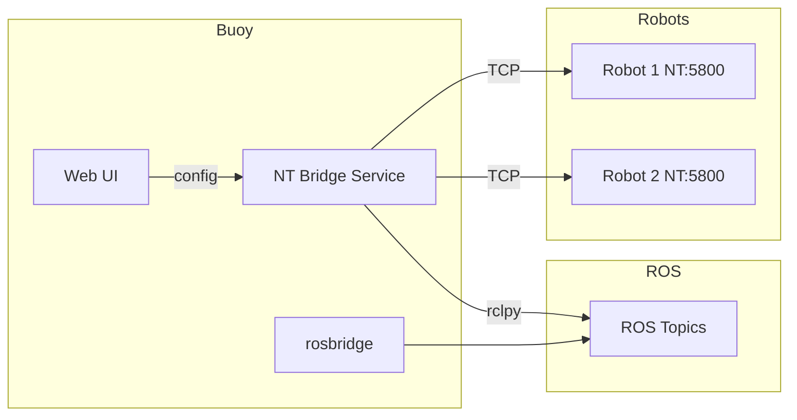

# NetworkTables Connector for FRC-ROS Bridge

**Status:** Plan (not yet implemented)

---

## How to Build Off This Plan

When implementing this feature, follow these steps in order. Each step builds on the previous.

### Implementation Order

1. **Bridge service** – Create `docker/nt_bridge/` with Python bridge, Dockerfile, and add `nt_bridge` to `docker/compose.yml` with `profiles: [frc]`. Test locally with `docker compose --profile frc up nt_bridge` (no robot needed for initial bring-up; bridge will fail to connect to NT but should start).
2. **Config and status server** – Bridge reads `$BUOY_ROOT/config/nt_bridge.json` and exposes HTTP status on port 9091. Use `BUOY_ROOT=/tmp/buoy` for local dev.
3. **Command center API** – Add `/api/nt-bridge` (GET/POST), `/api/nt-bridge/status` (proxy to bridge), `/api/features` (GET/POST), `/api/reboot` (POST). Follow the pattern in `server.js` for `/api/wifi`.
4. **Features tab** – Create `features.html` with FRC toggle and Reboot button. Wire to `/api/features` and `/api/reboot`.
5. **NetworkTables UI** – Create `networktables.html` with robot registry. Follow `gamepad.html` for nav, layout, and status badge.
6. **Ansible / systemd** – Add `buoy-frc.service` and start script. FRC is **runtime-enabled** via features.json (not Ansible vars like LLM). The playbook deploys the service; the service checks features.json on boot.
7. **Documentation** – Write `docs/networktables-frc.md` (user) and `docs/development/networktables-bridge.md` (developer).
8. **Image build** – If baking into SD image: add nt_bridge to `docker save` in `image/build-with-docker.sh`, add `frc` profile build. See `.cursor/rules/offline-first-docker.mdc`.

### Prerequisites

- **Buoy codebase** – ROS 2 Jazzy, rosbridge on port 9090, command center (Express) on port 80, host networking for Docker.
- **Python** – pynetworktables (RobotPy), rclpy (ROS 2). Bridge runs in a ROS base image container.
- **NetworkTables** – NT4 protocol, port 5800. Robot is server; bridge is client.
- **FRC familiarity** – Team IP format `10.TE.AM.2`, SmartDashboard/LiveWindow tables.

### External References

| Resource | URL / Package |
|----------|---------------|
| WPILib NetworkTables docs | https://docs.wpilib.org/en/stable/docs/software/networktables/networktables-intro.html |
| pynetworktables (RobotPy) | https://github.com/robotpy/pynetworktables |
| NT4 protocol spec | https://github.com/wpilibsuite/allwpilib/blob/main/ntcore/doc/networktables4.adoc |
| ROS 2 rclpy | https://docs.ros.org/en/jazzy/Tutorials/Beginner-Client-Libraries/Writing-A-Simple-Py-Publisher-And-Subscriber.html |

### Codebase Patterns to Follow

| New component | Copy pattern from |
|---------------|-------------------|
| Docker service with profile | `docker/compose.yml` – `ollama`, `whisper`, `llm_node` (profiles: llm) |
| Dockerfile (ROS base) | `docker/Dockerfile.rosbridge` |
| API GET/POST with JSON config | `command_center/server.js` – `/api/wifi` (lines 249–291) |
| API proxy to another service | `command_center/server.js` – `/api/llm` (lines 44–74) |
| API status check | `command_center/server.js` – `/api/llm/status` (lines 26–42) |
| Web page (nav, form, status) | `command_center/public/gamepad.html` |
| systemd service (profile-based) | `ansible/roles/llm/templates/buoy-llm.service.j2` |
| Ansible role for optional service | `ansible/roles/llm/tasks/main.yml` |

**Important difference from LLM:** LLM is enabled via Ansible var `llm_enable` at deploy time. FRC is enabled at **runtime** via the Features tab (`features.json`). The buoy-frc service must read features.json on each boot and only start nt_bridge if `frc: true`.

### Config Paths

| Config | Path | Purpose |
|--------|------|---------|
| nt_bridge | `$BUOY_ROOT/config/nt_bridge.json` | Robot registry, topic mappings |
| features | `$BUOY_ROOT/config/features.json` | `{ "frc": true \| false }` |
| buoy_root | `/opt/buoy` (prod), `BUOY_ROOT` env (override) | Base path for config, docker |

### Testing Without a Robot

- **Bridge startup** – Run `docker compose --profile frc up nt_bridge`; bridge should start, log "waiting for config" or "no robots", and expose HTTP on 9091.
- **Status API** – `curl http://localhost:9091/status` (or via command center proxy) should return `{ "robots": [] }`.
- **NT simulator** – WPILib does not ship a standalone NT server. Options: (a) use a real RoboRIO in test mode, (b) run a minimal NT server in Python (pynetworktables can run as server: `NetworkTables.startServer()`), or (c) mock the bridge’s NT client for unit tests.

---

## Background: NetworkTables vs Gamepad

**Gamepad**: Browser reads hardware (Gamepad API) and publishes directly to ROS via rosbridge (WebSocket). No backend bridge needed.

**NetworkTables**: The FRC robot (RoboRIO) runs the NT server on port 5800. Browsers cannot connect to raw TCP. A **bridge service** must run on the Buoy to:

1. Connect to the robot's NT server as a client
2. Subscribe to ROS topics and publish to NT (commands to robot)
3. Subscribe to NT topics and publish to ROS (telemetry from robot)



## Architecture

### 1. Bridge Service (Python) – Multi-Robot

- **Location**: New Docker service `nt_bridge` in [docker/compose.yml](../docker/compose.yml)
- **Stack**: `pynetworktables` (NT4 client) + `rclpy` (ROS 2)
- **Config**: JSON file at `$BUOY_ROOT/config/nt_bridge.json` with a **robots** array
- **Behavior**:
  - One bridge process maintains **multiple NT client connections** (one per registered robot)
  - `pynetworktables` supports multiple `NetworkTableInstance` objects; each robot gets its own instance
  - For each robot: connect to host:port, set up ROS↔NT mappings with **robot-specific ROS topic prefixes** to avoid collisions
  - Reconnects on disconnect per robot; logs connection status per robot
- **Status server**: Bridge runs a small HTTP server (e.g. port 9091) exposing `GET /status` returning `{ "robots": [{ "id": "...", "connected": true }] }`. Command center proxies to `/api/nt-bridge/status`.

### 2. Multi-Robot Config Structure

```json
{
  "robots": [
    {
      "id": "team1234",
      "label": "Practice Bot",
      "host": "10.12.34.2",
      "port": 5800,
      "ros_prefix": "/frc/team1234",
      "ros_to_nt": [
        { "ros": "/cmd_vel/frc_team1234", "nt": "/SmartDashboard/linearX", "field": "linear.x" }
      ],
      "nt_to_ros": [
        { "nt": "/SmartDashboard/VisionX", "ros": "/frc/team1234/vision/x" }
      ]
    },
    {
      "id": "team5678",
      "label": "Competition Bot",
      "host": "10.56.78.2",
      "port": 5800
    }
  ]
}
```

- **id**: Unique slug (e.g. team number); used in ROS topic names to avoid collisions
- **label**: Display name in the UI
- **ros_prefix**: Optional; defaults to `/frc/<id>` for NT→ROS topics
- **ros_to_nt** / **nt_to_ros**: Per-robot mappings; can inherit from a default template for new robots

For `geometry_msgs/msg/Twist`, split into three NT doubles (`linearX`, `linearY`, `angularZ`) under a configurable NT prefix. Recommend **split doubles** for compatibility with typical FRC robot code.

### 3. Web UI – Robot Registry

- **Page**: `command_center/public/networktables.html` (new)
- **Pattern**: Follow [gamepad.html](../command_center/public/gamepad.html) – same nav, status badge
- **Layout**:
  - **Registered robots** list: each row shows label, team/id, host, connection status (Connected / Disconnected / Connecting), edit/remove buttons
  - **Add robot** button opens form: label, team number (or custom id), host, port (default 5800)
  - **Edit robot**: expand row or modal with same fields + optional topic mappings
  - Per-robot connection status badge
- **API**: `GET/POST /api/nt-bridge` – full config with robots array; `POST` saves and bridge reloads

### 4. Command Center API

- Add `GET /api/nt-bridge` – return config with `robots` array (each robot: id, label, host, port, mappings)
- Add `POST /api/nt-bridge` – save config (full robots array); bridge watches config file and reconnects when it changes
- Add `GET /api/nt-bridge/status` – proxy to bridge's HTTP server (bridge exposes status on e.g. port 9091; command center proxies to avoid CORS). Avoids file I/O for status.

### 5. Features Tab and FRC Enablement

- **nt_bridge does NOT run by default**
- **Features tab** (new page or section): Toggle switches for optional features
  - **FRC (NetworkTables)**: On/Off. When On: start nt_bridge container; when Off: stop it
  - Persist to `$BUOY_ROOT/config/features.json`: `{ "frc": true | false }`
- **Reboot button**: Reboot the device. After reboot, buoy-frc.service runs and starts nt_bridge if FRC is enabled in features.json
- **Implementation**:
  - `buoy-frc.service`: Runs on boot; executes script that reads features.json and, if `frc: true`, runs `docker compose --profile frc up -d nt_bridge`
  - `POST /api/features`: Save features config; if FRC toggled on, start nt_bridge immediately; if off, stop it
  - `POST /api/reboot`: Reboot the device (requires appropriate permissions, e.g. sudo or polkit)

### 6. Integration Points

- Add "NetworkTables (FRC)" to ROS tools section in [index.html](../command_center/public/index.html)
- Add to ROS dropdown in all nav bars (gamepad.html, ros-try.html, etc.)
- Add "Features" to nav (or Settings) for FRC toggle and Reboot

## Documentation

### User Documentation

- **`docs/networktables-frc.md`** (or `command_center/public/docs/networktables-frc.md`): End-user guide
  - Enable FRC in Features tab
  - Add robots (team number, host, port)
  - Default topic mappings and how to customize
  - Network requirements (robot and Buoy on same network)
  - Example FRC robot code to read/write NT topics
  - Troubleshooting (connection failed, wrong IP, etc.)

### Developer Documentation

- **`docs/development/networktables-bridge.md`** (or section in existing dev docs): Developer guide
  - Bridge architecture (multi-NT-instance, ROS↔NT mapping)
  - Config file format (`nt_bridge.json`, `features.json`)
  - Bridge HTTP status server (port, response format)
  - How to add new message type mappings
  - Testing without a real robot (e.g. NT server simulator if available)

## Key Files to Create/Modify

| File | Action |
|------|--------|
| `docker/nt_bridge/` | New directory: `bridge.py`, `Dockerfile.nt_bridge`, `requirements.txt` |
| `docker/compose.yml` | Add `nt_bridge` service with `profiles: [frc]` |
| `command_center/public/networktables.html` | New UI: robot registry (add/edit/remove), per-robot status |
| `command_center/public/features.html` | New Features tab: FRC toggle, Reboot button |
| `command_center/server.js` | Add `/api/nt-bridge`, `/api/features`, `/api/reboot`, proxy `/api/nt-bridge/status` |
| `command_center/public/index.html` | Add NetworkTables card, Features link in nav |
| Nav bars | Add NetworkTables and Features links |
| `ansible/roles/ros2_docker/` or new `frc` role | Add `buoy-frc.service`, start script that reads features.json |
| `docs/networktables-frc.md` | User doc: setup, topic mapping, FRC robot code |
| `docs/development/networktables-bridge.md` | Developer doc: architecture, config, extending |

## Default Topic Mapping (per robot)

Out of the box, each registered robot gets a default mapping:

- **ROS** `/cmd_vel/frc_<id>` (Twist) → **NT** `/SmartDashboard/linearX`, `/SmartDashboard/linearY`, `/SmartDashboard/angularZ`
- **NT** `/SmartDashboard/*` → **ROS** `/frc/<id>/*` (configurable)
- Teams that use different NT topics can configure per-robot mappings in the UI.

## Network Requirements

- Robot (RoboRIO) and Buoy must be on the same network (e.g. FRC field network, or Buoy WiFi if robot/driver station connects to it)
- Robot IP is typically `10.TE.AM.2` (team number in TEAM)

## Resolved Decisions

1. **Profile**: nt_bridge does **not** run by default. Users enable FRC via the Features tab; a reboot ensures it starts on next boot.
2. **Per-robot status**: Bridge runs a small HTTP server (option b) to expose status; command center proxies it. Avoids file I/O concerns.

---

## Appendix: Project Context

**Buoy** is a headless ROS 2 Jazzy hub for Raspberry Pi: WiFi AP (hostapd), local `.buoy` DNS, web portal. All UIs are web-based. Key components:

- **rosbridge** – WebSocket on 9090, serves ROS to browsers (ROSLIB.js)
- **command_center** – Express app on port 80, serves dashboard, proxies APIs
- **Docker** – Host networking; services: `ros2_rosbridge`, optional `llm` profile (ollama, whisper, llm_node)
- **Ansible** – Playbook configures Pi: `ansible/roles/ros2_docker`, `llm`, `command_center`, etc.
- **Config** – Stored under `$BUOY_ROOT/config/` (wifi.json, etc.)

The FRC bridge adds an optional `frc` profile, similar to `llm`, but enablement is **runtime** (Features tab) not **deploy-time** (Ansible vars).
